# Building a Production-Style RAG System for Foundry Nuke Documentation

This is a technical walkthrough of the Nuke documentation RAG project in this repository. The system turns the Foundry Nuke 17.0 reference guide into a searchable, observable, and agentic question-answering product.

The implementation is not just a notebook that embeds documents and calls an LLM. It is a full application with ingestion orchestration, database persistence, hybrid retrieval, semantic caching, guardrails, observability, a Next.js user interface, and infrastructure that can run locally or on AWS.

## What the System Does

The goal is simple:

> Let a user ask questions about Foundry Nuke documentation and get grounded answers with source URLs.

The system does that through five major paths:

1. Ingestion crawls the Nuke 17.0 documentation, extracts useful pages, stores them, chunks them, embeds them, and indexes them.
2. Ray Data can parallelize chunking, embedding, and bulk indexing for larger ingestion runs.
3. Retrieval searches those chunks using keyword search, vector search, hybrid search, and optional Neo4j knowledge graph expansion in the agentic path.
4. Generation sends the retrieved context to a local Ollama model.
5. Agentic RAG runs a LangGraph workflow with guardrails, query rewriting, retrieval grading, reranking, and output validation.
6. Observability records metrics, logs, traces, cache behavior, and service health.

At a high level:

```text
Foundry Nuke docs
  -> scraper
  -> PostgreSQL nuke_pages
  -> chunker or Ray Data indexing pipeline
  -> Jina embeddings
  -> PostgreSQL pg_embedding or OpenSearch
  -> optional Neo4j knowledge graph
  -> FastAPI RAG endpoints
  -> Ollama or LangGraph agent
  -> Next.js UI
  -> Prometheus, Grafana, Loki, Langfuse
```

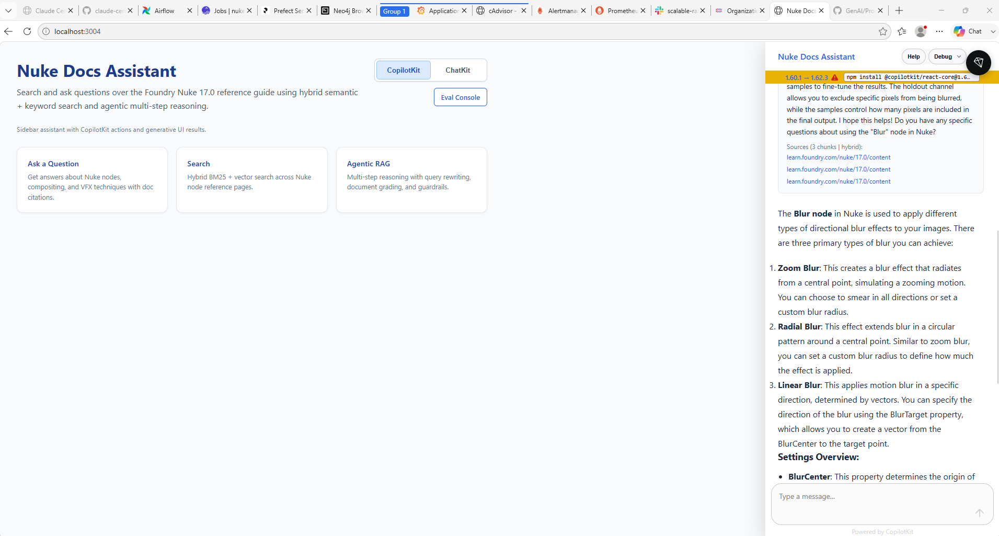

The user-facing result is a local Nuke Docs Assistant. The screenshot above shows the CopilotKit panel answering a question about the Blur node with grounded source links from the Foundry documentation. That is the visible part of the system; the rest of this post explains the ingestion, retrieval, orchestration, and observability machinery behind it.

| Panel | Scene |
| --- | --- |
| 1 | Developer: "Can we just put the docs in a prompt?" |
| 2 | Database: "The docs are bigger than your context window." |
| 3 | Search Backend: "Let me find the right chunks first." |
| 4 | Observability: "And I will tell you which part is slow when it breaks." |

## Repository Shape

The project is split by responsibility:

```text
api/
  FastAPI backend, schemas, repositories, services, search backends,
  embeddings, caching, LangGraph agents, guardrails, evaluation, metrics

ui/
  Next.js chat interface, CopilotKit integration, ChatKit integration,
  API proxy routes

orchestrators/
  Airflow, Prefect, and Dagster ingestion implementations

infra/
  Docker Compose, Nginx, Prometheus, Grafana, Loki, Promtail,
  Alertmanager, Terraform AWS layers

tests/
  Shared service and ingestion tests
```

The important point is that the same logical ingestion pipeline can be driven by three different orchestrators. The rest of the application does not need to know whether Airflow, Prefect, or Dagster produced the indexed chunks.

## The Ingestion Pipeline

The ingestion pipeline starts in `orchestrators/airflow/dags/nuke_docs_ingestion.py`. The Airflow DAG is called `nuke_docs_ingestion`, and the Nuke version is deliberately hardcoded as `17.0` to avoid accidental multi-version index collisions.

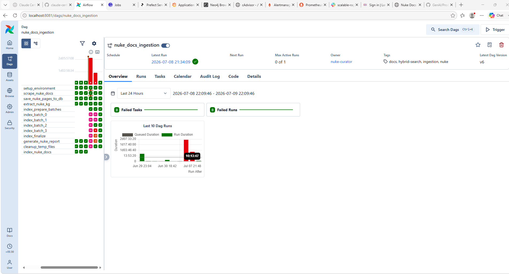

Airflow gives the ingestion path an operational view: each task is visible, retries are explicit, and failed batch work is easy to isolate. In this run, the left-hand task grid shows the scrape, database save, knowledge graph extraction, indexing batches, report generation, and cleanup steps as separate units. That matters because ingestion is where most external dependencies meet: the Foundry website, PostgreSQL, embeddings, search indexing, and optional graph extraction.

The logical pipeline is:

```text
setup_environment
  -> scrape_nuke_docs
  -> save_nuke_pages_to_db
  -> index_prepare_batches
  -> index_batch_0..N
  -> index_finalize
  -> generate_nuke_report
  -> cleanup_temp_files

save_nuke_pages_to_db
  -> extract_nuke_kg
```

Indexing and knowledge graph extraction run in parallel after pages are saved.

## Three Ways to Orchestrate the Same Ingestion Job

This repository includes Airflow, Prefect, and Dagster implementations because orchestration is an operational choice, not a change to the RAG product. The same logical job still scrapes Nuke pages, saves them, chunks them, embeds them, indexes them, and records what happened.

Airflow is the most explicit DAG view. It is useful when you want task-level scheduling, retries, logs, and a familiar operations console for batch pipelines.


Prefect presents the same ingestion as a flow. In this project, that is useful for a lighter-weight local or service-driven workflow where the flow name, deployment, run history, and work pools are the main control surface.

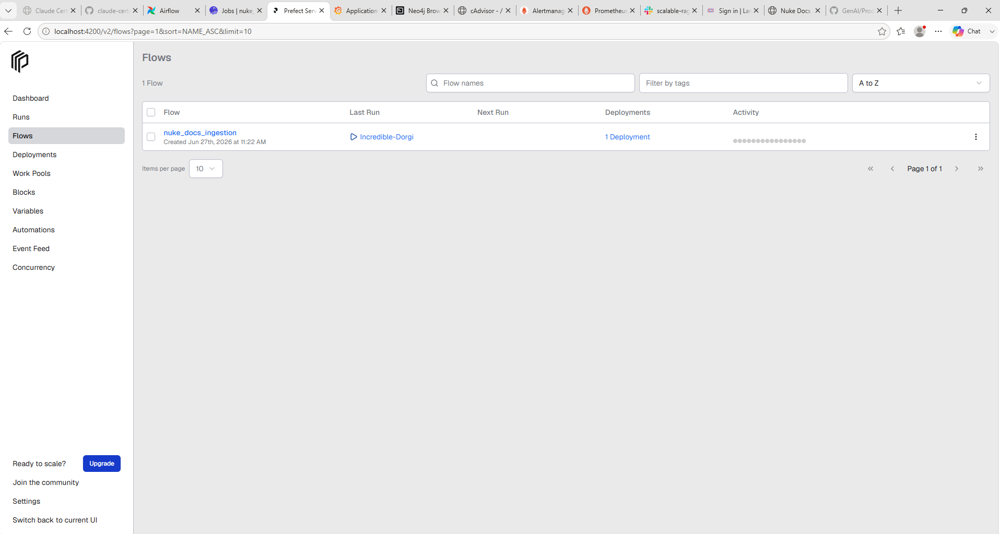

Dagster presents the ingestion job through assets. That view is useful when the important question is not only "did the task run?" but "which data products were materialized?" In the screenshot, scraped pages, saved pages, and indexed docs appear as connected assets.

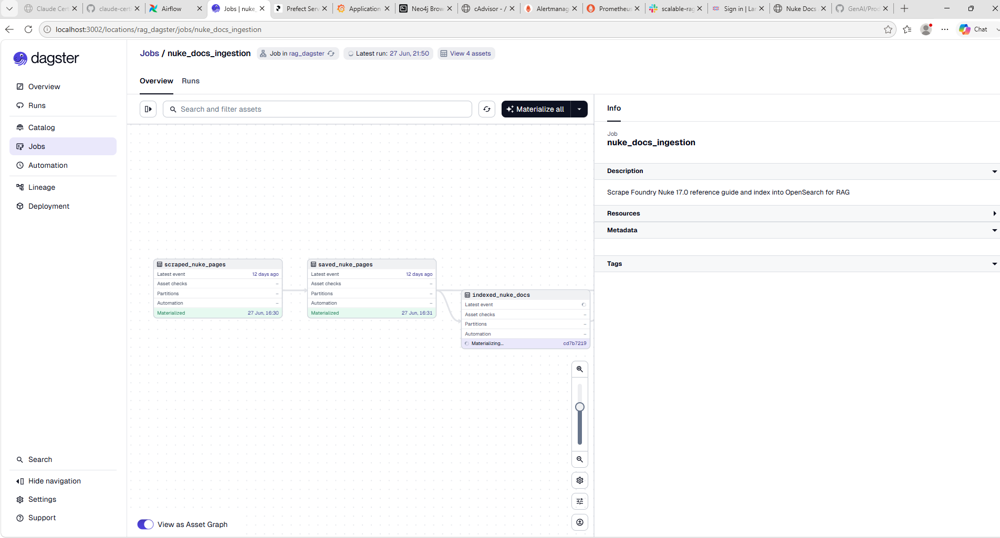

The important boundary is that these tools sit outside request serving. Users do not wait for Airflow, Prefect, or Dagster when they ask a question. The orchestrators build and refresh the index; FastAPI reads from the finished index.

### Crawling the Nuke Docs

The scraper lives in `orchestrators/airflow/dags/nuke_ingestion/scraping.py`.

It uses:

- `requests` for HTTP calls
- `BeautifulSoup` from `beautifulsoup4` for HTML parsing
- `tempfile` and JSON files to pass scraped data between Airflow tasks without hitting XCom size limits

The crawler starts at:

```text
https://learn.foundry.com/nuke/17.0/content/reference_guide.html
```

It follows a three-level navigation strategy:

```text
reference guide TOC
  -> section index pages
  -> subsection index pages
  -> individual node pages
```

Each page is parsed by finding the main documentation content, usually `div.mc-main-content`. The scraper extracts:

- URL
- node name
- section
- full text content
- `h2`-delimited sections when available

Pages with fewer than 100 words are skipped. That avoids indexing stub pages and table-of-contents pages that are not useful retrieval units.

The scraper also applies a 1 request per second crawl delay. That is a practical courtesy limit for documentation scraping and keeps ingestion predictable.

### Saving Pages to PostgreSQL

Scraped pages are stored in the `nuke_pages` table represented by `api/models/nuke_page.py`.

Important columns include:

- `url`: unique source URL
- `node_name`: Nuke node name
- `section`: documentation section
- `raw_content`: extracted text
- `sections`: JSONB section structure
- `nuke_pages_indexed`: whether the page has been embedded and indexed
- `kg_extracted`: whether graph extraction has run

The ingestion pipeline can safely retry because pages are upserted by URL and indexed pages are marked after successful indexing.

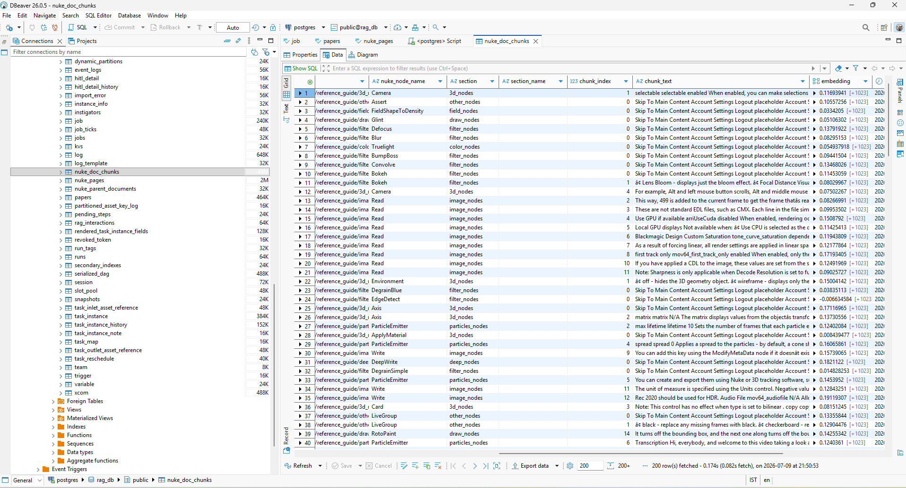

DBeaver is useful here because it shows the database state after ingestion in a concrete way. The `nuke_doc_chunks` table contains the retrievable units the API will search later: source URL, Nuke node name, section metadata, chunk index, chunk text, and a 1024-dimensional embedding array. When an ingestion run looks successful in Airflow, Prefect, or Dagster, this is the place to verify that the chunks actually landed in PostgreSQL.

| Panel | Scene |
| --- | --- |
| 1 | Scraper: "I found another Nuke node page." |
| 2 | PostgreSQL: "Give it an ID, a URL, and the raw text. I will remember it." |
| 3 | Chunker: "I will cut it by meaning, not just by character count." |
| 4 | Indexer: "Once the vectors land safely, I will mark the page as indexed." |

## Chunking Strategy

Chunking is one of the most important RAG decisions in the project.

The default settings in `api/config.py` are:

```text
chunk_size = 600
overlap_size = 100
min_chunk_size = 100
splitter_type = recursive
section_based = true
```

There are two chunking paths:

1. A word-oriented chunker in `api/services/indexing/text_chunker.py`.
2. A LangChain recursive splitter path in `orchestrators/airflow/dags/nuke_ingestion/indexing.py`.

The indexing code prefers section-aware chunking when section data exists. That means an `h2` section such as "Controls", "Inputs", or "Examples" is chunked independently instead of blindly slicing through the whole page.

That is useful for documentation because headings often define semantic boundaries. A chunk that contains one node parameter section is usually more retrievable than a chunk that spans unrelated sections.

The project also supports a parent-child chunking mode:

```text
parent document: larger context window
child chunk: smaller retrieval unit
```

In that mode, child chunks are used for search precision while parent documents are stored separately for broader context reconstruction.

| Panel | Scene |
| --- | --- |
| 1 | Full Page: "I contain everything about this node." |
| 2 | Retriever: "That is admirable, but I only need the relevant section." |
| 3 | Section Heading: "I can keep the context organized." |
| 4 | Chunk: "Small enough to retrieve, large enough to make sense." |

## Embeddings

Embeddings are handled by `api/services/embeddings/jina_client.py`.

The main embedding model is:

```text
jina-embeddings-v3
dimension: 1024
```

The client uses different Jina task modes:

- `retrieval.passage` for document chunks
- `retrieval.query` for user queries

The implementation uses `httpx.AsyncClient`, retry logic, and exponential backoff for status codes such as `429` and `503`.

There is also a local fallback:

```text
BAAI/bge-large-en-v1.5
```

That fallback is loaded through `sentence-transformers` if the Jina API repeatedly fails. This is a resilience choice: ingestion or querying can continue even if the external embedding service is temporarily unavailable.

The same embedding dimension must be respected throughout the system:

- Jina outputs 1024-dimensional vectors.
- PostgreSQL `pg_embedding` HNSW indexes are created with `dims = 1024`.
- OpenSearch `knn_vector` mappings use `dimension = 1024`.
- Semantic cache vector indexes also use the configured search vector dimension.

| Panel | Scene |
| --- | --- |
| 1 | Query: "The user asked about motion blur settings." |
| 2 | Embedding Model: "I translated that into 1024 numbers." |
| 3 | Vector Index: "I know which chunks live near that meaning." |
| 4 | Backend: "Just make sure everyone agrees on 1024 dimensions." |

## Indexing at Scale

Indexing is implemented in `orchestrators/airflow/dags/nuke_ingestion/indexing.py`.

The indexing task:

1. Loads unindexed pages from PostgreSQL.
2. Splits pages into chunks.
3. Embeds chunks in batches.
4. Writes chunks to the configured search backend.
5. Marks pages as indexed only after successful chunk indexing.

The pipeline has two parallelism models.

### Batch-Level Parallelism

Airflow prepares page batches using `index_nuke_docs_dynamic`.

The default parallelism is:

```text
DEFAULT_NUM_PODS = 4
```

The DAG currently simulates pod-style batch execution with `PythonOperator` tasks named:

```text
index_batch_0
index_batch_1
index_batch_2
index_batch_3
```

The comments show where `KubernetesPodOperator` could replace the local task wrapper in a cluster deployment.

### Ray Data Parallelism

Inside each batch, the project can use Ray Data:

```text
pages
  -> flat_map(chunk)
  -> map_batches(embed)
  -> map_batches(bulk index)
```

This is useful because embedding and indexing are naturally batch-oriented. A single page can produce many chunks, and each chunk needs a vector before it can be written to PostgreSQL or OpenSearch. Ray lets the pipeline express that as data transformations instead of a hand-managed worker loop.

The Ray settings are exposed through environment variables:

```text
RAG_RAY_NUM_CPUS
RAG_RAY_OBJECT_STORE_MEMORY_BYTES
RAG_RAY_EMBED_BATCH_SIZE
RAG_RAY_EMBED_CONCURRENCY
RAG_RAY_BULK_BATCH_SIZE
RAG_RAY_BULK_CONCURRENCY
```

This makes it possible to tune indexing for memory-constrained Airflow containers. For example, embedding batch size and concurrency can be reduced when the Airflow worker has limited memory, while bulk indexing concurrency can be adjusted separately from embedding throughput.

The important design point is that Ray is used inside the ingestion path, not the request-serving path. User queries should not wait for distributed compute setup. Ray helps build the index faster; FastAPI serves from the finished index.

## Search Backend 1: PostgreSQL with pg_embedding

The default search backend is PostgreSQL using the archived `pg_embedding` extension. The implementation is in `api/search/postgres_embedding.py`.

The chunk table is represented by `api/models/nuke_doc_chunk.py`.

Important fields:

- `chunk_id`: deterministic primary key
- `page_id`: foreign key to `nuke_pages`
- `parent_doc_id`: optional parent-child retrieval link
- `url`
- `nuke_node_name`
- `section`
- `section_name`
- `chunk_text`
- `embedding`: `ARRAY(REAL)`

The backend creates:

1. A full-text index:

```sql
CREATE INDEX IF NOT EXISTS ix_nuke_doc_chunks_fts
ON nuke_doc_chunks
USING GIN (to_tsvector('english', chunk_text));
```

2. An HNSW vector index:

```sql
CREATE INDEX IF NOT EXISTS ix_nuke_doc_chunks_embedding_hnsw
ON nuke_doc_chunks
USING hnsw (embedding ann_cos_ops)
WITH (dims = 1024);
```

The backend supports three search modes.

### Keyword Search

Keyword search uses PostgreSQL full-text search:

```sql
websearch_to_tsquery('english', :query)
ts_rank_cd(to_tsvector('english', chunk_text), q.tsq)
```

This is good for exact terms, node names, parameter names, and phrases that appear directly in the docs.

### Vector Search

Vector search orders rows by cosine-like distance:

```sql
ORDER BY embedding <=> CAST(:embedding AS real[])
```

The score is normalized as:

```text
1 / (1 + distance)
```

This works better when the user asks conceptually related questions that do not use the exact wording of the documentation.

### Hybrid Search

Hybrid search runs both keyword and vector search, ranks each result set, and fuses the rankings with reciprocal rank fusion:

```text
score = 1 / (rrf_constant + rank)
```

The default RRF constant is:

```text
SEARCH__RRF_CONSTANT = 60
```

The default candidate multiplier is:

```text
SEARCH__HYBRID_CANDIDATE_MULTIPLIER = 2
```

This means the backend retrieves more candidates than the final `top_k`, fuses them, and returns the strongest combined matches.

## Search Backend 2: OpenSearch

OpenSearch remains available as a fallback or alternate backend. The implementation is in `api/services/opensearch/client.py`.

The OpenSearch index stores:

- chunk metadata
- analyzed `chunk_text`
- 1024-dimensional `knn_vector` embeddings

The mapping enables kNN search and uses HNSW with FAISS:

```text
embedding:
  type: knn_vector
  dimension: 1024
  method:
    name: hnsw
    engine: faiss
```

The OpenSearch client supports:

- BM25-only search
- pure vector kNN search
- hybrid search using OpenSearch's native hybrid query and an RRF search pipeline

Switching between PostgreSQL and OpenSearch is controlled by:

```text
SEARCH__BACKEND=postgres_embedding
SEARCH__BACKEND=opensearch
```

That abstraction is important because the API routes call a common `search_unified` method. The application can change search infrastructure without rewriting the RAG endpoint.

| Panel | Scene |
| --- | --- |
| 1 | BM25: "I am excellent when the user names the exact parameter." |
| 2 | Vector Search: "I help when the user describes the idea vaguely." |
| 3 | RRF: "Both of you bring candidates. I will rank the combined list." |
| 4 | API: "Perfect. I will just call `search_unified`." |

## Knowledge Graph Retrieval with Neo4j

The vector and keyword search backends are not the only retrieval source in the project. The agentic retriever can also enrich results with a Neo4j knowledge graph.

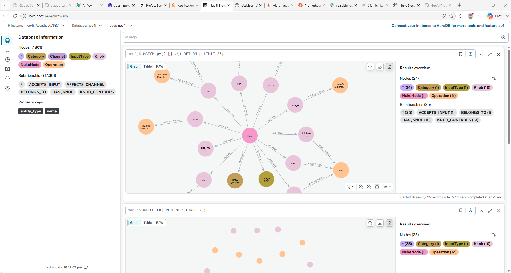

The graph view makes the relationship layer concrete. In this example, a Nuke node such as `Flare` is connected to knobs, categories, operations, and input types. Those edges are compact facts that can complement chunk retrieval when the user asks about a specific node.

This is implemented in `api/services/agents/tools.py`.

The retriever tool does two things in parallel:

```text
hybrid branch:
  query -> Jina query embedding -> search_unified -> chunks

knowledge graph branch:
  detect Nuke node entity -> Neo4j 1-hop lookup -> graph facts
```

Then it merges and deduplicates:

```text
hybrid docs + KG docs -> merged context for LangGraph
```

The KG path is optional. If `graph_client` is `None`, or no known Nuke node entity is detected in the query, the retriever simply returns the hybrid search results.

Neo4j retrieval is intentionally entity-based. The tool checks the query against known Nuke node names, preferring longer names first so a specific node like `Merge2` is not accidentally shadowed by a shorter match like `Merge`.

The Neo4j client in `api/services/graph/client.py` runs a one-hop query:

```text
MATCH (n:NukeNode {name: $entity})-[r]-(m)
RETURN m.name AS neighbor, type(r) AS rel_type
LIMIT 10
```

Each returned relationship is converted into a small LangChain `Document`, for example:

```text
Blur has knob size.
```

with metadata such as:

```text
source = kg
entity = Blur
neighbor = size
rel_type = HAS_KNOB
```

This means the agentic retrieval path is not only BM25 plus vectors. It is:

```text
BM25 + vector retrieval + optional Neo4j graph facts
```

That matters for documentation because graph facts capture explicit relationships such as:

- a Nuke node has a knob
- a knob controls an operation
- a node accepts an input type
- a node belongs to a category
- a setting affects a channel

The design tradeoff is precision versus coverage. The KG branch is strongest when the query names a known node. For broader conceptual questions, hybrid text retrieval still does most of the work.

## The FastAPI Backend

The API is defined in `api/main.py`.

The main routes are:

```text
GET  /api/v1/health
GET  /metrics
POST /api/v1/hybrid-search
POST /api/v1/ask
POST /api/v1/stream
POST /api/v1/ask-agentic
```

At startup, the FastAPI lifespan creates long-lived service clients and attaches them to `app.state`:

```text
database
  -> search client
  -> Jina embeddings client
  -> Ollama client
  -> Langfuse client
  -> Redis cache
  -> LangGraph checkpointer pool
  -> AgenticRAGService
```

This avoids recreating expensive clients on every request.

Configuration is handled through Pydantic settings in `api/config.py`. Nested environment variables use `__`, for example:

```text
SEARCH__BACKEND
SEARCH__VECTOR_DIMENSION
REDIS__SEMANTIC_CACHE_ENABLED
CHUNKING__SPLITTER_TYPE
LANGFUSE__HOST
GUARDRAILS__ENABLED
```

## The Simple RAG Endpoint

The `/api/v1/ask` implementation lives in `api/routers/ask.py`.

The flow is:

```text
request
  -> exact Redis cache lookup
  -> optional semantic cache lookup
  -> query embedding
  -> search_unified
  -> prompt construction
  -> Ollama generation
  -> exact cache store
  -> optional semantic cache store
  -> interaction record in PostgreSQL
```

The endpoint records latency metrics for:

- embedding calls
- search calls
- LLM generation

It also traces the request through Langfuse using `RAGTracer`.

The streaming endpoint `/api/v1/stream` follows the same retrieval logic but returns Server-Sent Event style chunks.

## Exact-Match Caching

The exact cache uses Redis.

For `/ask` and `/stream`, the cache key is a SHA256 hash of answer-shaping request fields:

- query
- model
- `top_k`
- hybrid flag
- categories
- knowledge source

The default TTL is 6 hours:

```text
REDIS__TTL_HOURS = 6
```

Exact caching is simple but valuable. If a user asks the same question with the same settings, the system can skip retrieval and generation entirely.

## Semantic Final-Answer Caching

Semantic caching is implemented in `api/services/cache/semantic.py`.

Unlike exact-match caching, semantic caching tries to reuse an answer for a semantically similar query.

This is intentionally disabled by default:

```text
REDIS__SEMANTIC_CACHE_ENABLED=false
```

The reason is that semantic caching requires Redis Stack or another Redis deployment with RediSearch vector commands. Plain Redis is enough for exact caching but not vector similarity search.

At startup, the semantic cache checks:

```text
FT._LIST
```

If Redis does not support RediSearch, the app still boots. It records semantic-cache bypasses instead of failing the API.

### Semantic Cache Scope

The semantic cache does not match only on query vector distance. It builds a scope hash from every field that can shape the final answer:

- endpoint
- response schema version
- generation model
- prompt version
- embedding model version
- embedding dimension
- search backend
- search index name
- search configuration
- chunking configuration
- knowledge source
- categories
- `top_k`
- hybrid flag
- app version
- semantic cache scope version

That scope hash prevents a cached answer from being reused after meaningful system changes.

For example, after changing chunking, prompts, search backend, or ingestion content, rotate:

```text
REDIS__SEMANTIC_CACHE_SCOPE_VERSION=v2
```

### Vector Cache Lookup

Semantic cache entries are Redis hashes with:

- query
- endpoint
- scope hash
- serialized response
- query embedding bytes

The Redis index uses HNSW vector search with cosine distance. A hit is accepted only if the distance is under:

```text
REDIS__SEMANTIC_CACHE_DISTANCE_THRESHOLD=0.08
```

This design is conservative. It prefers missing the cache over serving a stale or wrongly scoped answer.

| Panel | Scene |
| --- | --- |
| 1 | Cache Entry: "I have an answer that looks close." |
| 2 | Scope Hash: "Was it created with the same model, prompt, chunks, backend, and settings?" |
| 3 | Distance Threshold: "Is the query actually close enough?" |
| 4 | RAG Endpoint: "If either answer is no, we do the live retrieval path." |

## Agentic RAG with LangGraph

The agentic path is documented in `api/services/agents/README.md` and implemented under `api/services/agents/`.

The workflow is:

```text
User Question
  -> InputGuardrail
  -> IntentClassify
  -> Retrieve
  -> ToolRetrieve
  -> Rerank
  -> GradeDocuments
  -> GenerateAnswer
  -> OutputGuardrail
  -> END
```

There are two important branches:

```text
InputGuardrail unsafe
  -> SafetyRefusal
  -> END

GradeDocuments insufficient
  -> RewriteQuery
  -> Retrieve again
```

And output validation can route to:

```text
OutputGuardrail unsafe
  -> SafetyRefusal

OutputGuardrail grounding_failed
  -> OutOfScope
```

The agent uses multiple guardrail layers:

- Presidio for PII detection and redaction
- Llama Guard for safety classification
- Policy adapters for normalized guardrail scoring
- Intent classification to reject off-topic questions
- Grounding checks to avoid unsupported answers

LangGraph checkpointing uses PostgreSQL through `AsyncPostgresSaver`, with a separate connection pool so agent state does not compete unbounded with the sync SQLAlchemy pool.

| Panel | Scene |
| --- | --- |
| 1 | Input Guardrail: "First, I check safety and redact sensitive details." |
| 2 | Intent Classifier: "Then I confirm this is actually about Nuke or VFX." |
| 3 | Retriever: "I bring evidence from the docs." |
| 4 | Output Guardrail: "And I make sure the final answer is safe and grounded." |

## Knowledge Graph Extraction

The ingestion DAG also runs knowledge graph extraction through `extract_nuke_kg`. The codebase contains graph clients and extraction services under:

```text
api/services/graph/
api/knowledge_graph/
```

Neo4j is available as an optional Docker Compose profile:

```text
docker compose --profile neo4j up -d
```

The graph index is maintained separately from the vector index, but the agentic retriever can use both at query time. Hybrid text retrieval supplies ranked documentation chunks, while Neo4j supplies compact relationship facts for detected Nuke node entities.

## UI: Next.js Chat Interface

The frontend lives in `ui/`.


The UI is intentionally more than a plain search box. It exposes a chat assistant, hybrid search, and the agentic RAG path from the same browser surface, while still showing source-backed answers to the user.

It uses:

- Next.js 15
- React 19
- TypeScript
- CopilotKit
- OpenAI ChatKit
- OpenAI Node SDK

The UI has components such as:

- `RAGCopilot.tsx`: CopilotKit sidebar
- `ChatKitPanel.tsx`: embedded ChatKit UI
- `AgentSteps.tsx`: intermediate LangGraph node steps
- `NukeResults.tsx`: documentation result cards

The UI exposes several API routes:

```text
app/api/copilotkit/[[...slug]]
app/api/chatkit/session/route.ts
app/api/openai-chat/route.ts
app/api/eval/[...path]/route.ts
```

In local development:

```bash
cd ui
npm install
npm run dev
```

The UI development server runs on port `3002`. In Docker, the UI is exposed as port `3004` and sits behind Nginx.

## Infrastructure

The main local stack is defined in `docker-compose.yaml`.

Core services include:

- PostgreSQL with `pg_embedding`
- Redis
- Valkey
- OpenSearch
- OpenSearch Dashboards
- FastAPI API container
- Next.js UI container
- Nginx
- Ollama integration from the API side
- Langfuse
- ClickHouse for Langfuse analytics
- MinIO for Langfuse storage
- Prometheus
- Grafana
- Loki
- Promtail
- Alertmanager
- StatsD exporter
- Node exporter
- Optional Neo4j
- Optional Airflow, Prefect, or Dagster profiles

The local PostgreSQL image is custom:

```text
infra/postgres-pg-embedding/Dockerfile
```

It installs the archived `pg_embedding` extension so the default PostgreSQL search backend can create HNSW indexes.

## Nginx Reverse Proxy

Nginx is configured in `infra/nginx/nginx.conf`.

It provides a single browser-facing origin:

```text
/
  -> Next.js UI

/api/v1/*
  -> FastAPI API

/airflow/
  -> Airflow API server

/grafana/
  -> Grafana
```

It also applies practical controls:

- hides `/metrics` from external access
- rate limits expensive LLM endpoints
- uses stricter rate limits for agentic RAG
- disables buffering for `/api/v1/stream` so SSE frames arrive immediately
- emits JSON access logs that Promtail can ship to Loki

| Panel | Scene |
| --- | --- |
| 1 | Browser: "I only want one origin." |
| 2 | Nginx: "UI requests go this way. API requests go that way." |
| 3 | Streaming Endpoint: "Please do not buffer my tokens." |
| 4 | Rate Limiter: "And slow down before the expensive endpoints melt." |

## Observability

The observability stack is defined under `infra/monitoring/`.

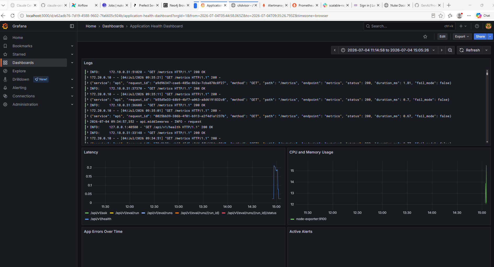

Grafana is the main operations surface. The dashboard combines API logs, endpoint latency, CPU and memory usage, error trends, and active alerts so a slow or broken answer can be traced back to a concrete stage.

The main components are:

```text
Prometheus
  scrapes metrics

Grafana
  visualizes metrics and logs

Loki
  stores logs

Promtail
  ships Docker container logs to Loki

StatsD exporter
  bridges Airflow/API StatsD metrics into Prometheus

Node exporter
  exposes host system metrics

Alertmanager
  handles alerts, including Slack webhook routing

Langfuse
  traces LLM, retrieval, prompt, and LangGraph work
```

Prometheus scrapes:

```text
api:8000/metrics
statsd-exporter:9102/metrics
node-exporter:9100/metrics
```

The FastAPI app exposes metrics through two mechanisms:

1. `prometheus-fastapi-instrumentator` for standard FastAPI metrics.
2. Custom counters and histograms in `api/metrics.py`.

Important custom metrics include:

```text
app_requests_total
app_errors_total
app_request_duration_seconds
rag_cache_hits_total
rag_cache_misses_total
rag_semantic_cache_hits_total
rag_semantic_cache_misses_total
rag_semantic_cache_bypasses_total
rag_semantic_cache_distance
rag_embedding_duration_seconds
rag_search_duration_seconds
rag_llm_generation_duration_seconds
rag_search_results_returned
rag_agentic_retrieval_attempts
rag_agentic_reasoning_steps
rag_service_health
```

The `MetricsMiddleware` in `api/middlewares.py` records request count, latency, and error severity by route. It also logs structured request metadata.

Langfuse traces are handled by `api/services/langfuse/`. The RAG endpoint traces:

- request lifecycle
- embedding calls
- search spans
- prompt construction
- generation

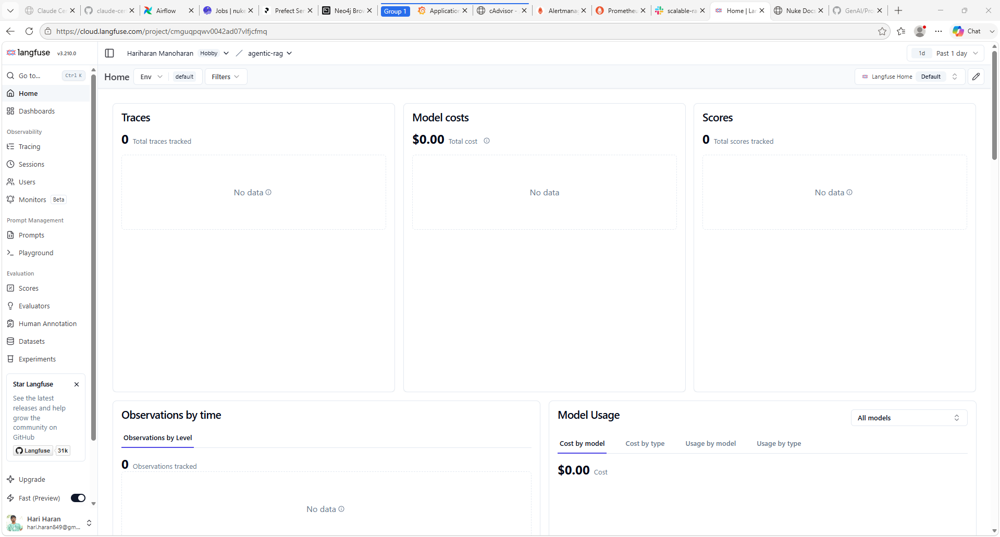

Langfuse provides the request-level trace. It is the place to inspect prompts, retrieved chunks, model calls, and agent steps after the metrics say that something changed.

For debugging RAG systems, that trace separation matters. A slow answer can come from embedding latency, search latency, LLM latency, cache misses, or retry loops. The metrics make those causes visible.

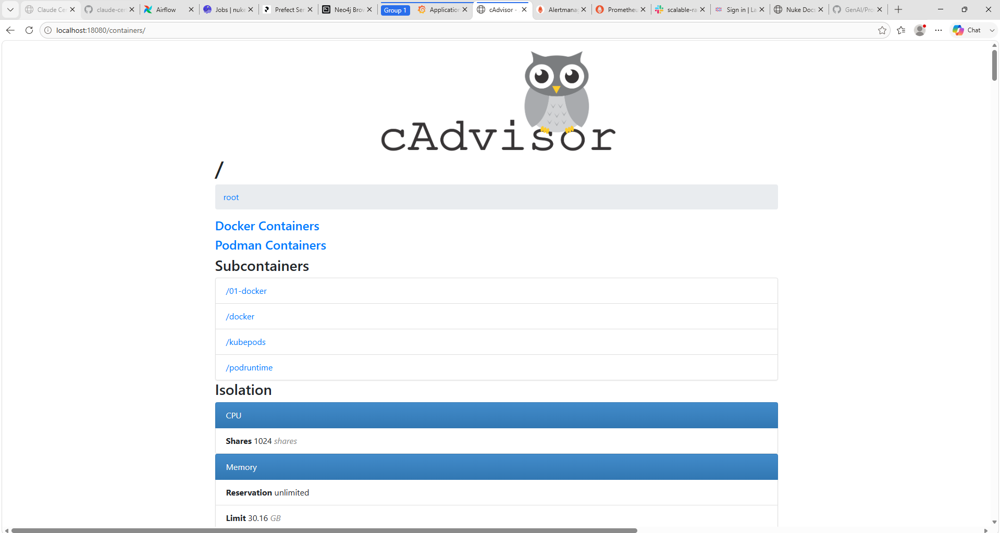

cAdvisor fills in the container-level picture. It helps answer whether the problem is in the RAG logic or in the local Docker runtime, for example CPU pressure, memory pressure, or a noisy service in the same compose stack.

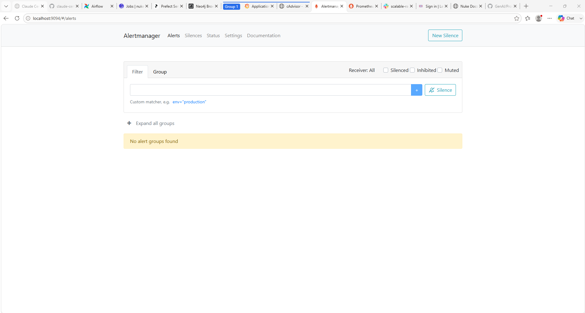

Alertmanager closes the loop by turning metric conditions into routed alerts. In this project, alerts can be sent to Slack so ingestion failures, API health problems, or infrastructure pressure do not depend on someone watching dashboards manually.

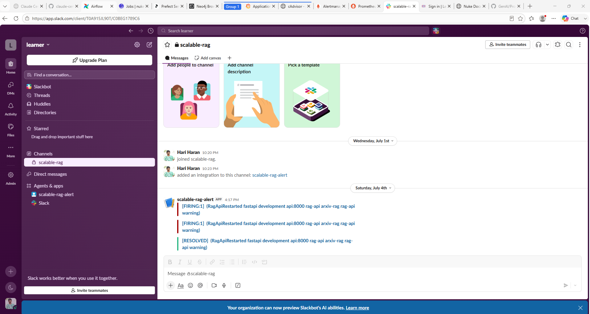

The Slack notification is deliberately boring: it carries the alert state, affected service, severity, and useful labels. For a RAG system, that is usually more valuable than a generic "something failed" message.

| Panel | Scene |
| --- | --- |
| 1 | User: "The answer was slow." |
| 2 | Prometheus: "Search was fast, but generation took 18 seconds." |
| 3 | Langfuse: "Here is the prompt, retrieved chunks, and model call." |
| 4 | Grafana: "Here is the pattern across the last hour." |

## Evaluation

The repository includes an evaluation harness under `api/evaluation/`.

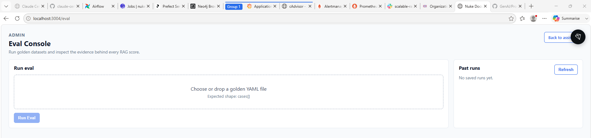

The evaluation console gives the project a feedback loop beyond manual chat testing. It is useful for comparing runs, checking status, and treating answer quality as something that can be inspected repeatedly instead of judged by a single demo question.

It uses:

- DeepEval
- a golden dataset YAML file
- OpenAI judge model configuration, defaulting to `gpt-4o-mini`

The production answer model can remain local through Ollama, while the evaluator uses a stronger judge model to score answer quality more consistently.

This separation is practical. A small local model may be good enough for an interactive demo, but it is often too weak to judge regressions reliably.

## Local Development Flow

A typical local run is:

```bash
cp .env_example .env
docker compose up -d
uv sync
uvicorn api.main:app --host 0.0.0.0 --port 8083 --reload
```

Then choose one ingestion orchestrator:

```bash
docker compose --profile airflow up -d
docker compose --profile prefect up -d
docker compose --profile dagster up -d
```

Then run the UI:

```bash
cd ui
npm install
npm run dev
```

Key local ports:

```text
FastAPI:               8083
Next.js UI:            3002 locally, 3004 in Docker
Nginx:                 80
Airflow:               8081
Prefect:               4200
Dagster:               3002
OpenSearch:            9200
OpenSearch Dashboards: 5601
Langfuse:              3001
Grafana:               3000
Prometheus:            9099
Loki:                  3100
PostgreSQL:            5436
Neo4j:                 7474 and 7687
```

## AWS Deployment Shape

Terraform configuration lives under `infra/terraform/`.

The deployment is split into four independently deployable layers:

```text
01-infra
  VPC, OpenSearch EC2, PostgreSQL, Redis, Langfuse, monitoring

02-api
  FastAPI and Ollama EC2

03-ui
  Next.js UI EC2

04-endpoints
  ALB, target groups, DNS
```

Reusable modules live under:

```text
infra/terraform/modules/
```

This layered design keeps slow-changing infrastructure separate from application hosts and public routing.

## Why This Architecture Works

The project works because it makes explicit decisions about reliability, retrieval quality, operating cost, and failure behavior.

### 1. Ingestion is offline, serving is online

The API does not scrape Foundry documentation during user requests. Ingestion crawls pages ahead of time, writes them to `nuke_pages`, chunks and embeds them, and only then marks them as indexed.

That choice has a direct operational benefit: user-facing latency depends on Redis, the search backend, embeddings for the query, and Ollama generation. It does not depend on Foundry website availability or scraper performance.

The tradeoff is freshness. If the upstream documentation changes, the system needs another ingestion run. For a versioned corpus like Nuke 17.0 docs, that is a good trade.

### 2. Nuke versioning is intentionally strict

The Airflow DAG hardcodes:

```text
NUKE_VERSION = "17.0"
```

That looks less flexible than a runtime parameter, but it prevents a real failure mode: accidentally mixing chunks from different Nuke versions into the same index. For documentation RAG, version mixing is dangerous because two versions can contain similar node names with different behavior.

The lesson is that not every parameter should be user-configurable. Some values define corpus identity and should change only through a deliberate code change or migration.

### 3. Scraped data moves by file, not oversized XCom payloads

The scraper writes pages to a temporary JSON file and passes the file path through Airflow XCom. That avoids storing hundreds of documentation pages directly in XCom.

This is a small design decision with large stability impact. Orchestrator metadata stores are not document stores. Passing references instead of large payloads keeps the DAG more reliable.

### 4. Ray belongs in ingestion, not request serving

Ray Data is used to parallelize the expensive ingestion work: chunking pages, embedding batches, and bulk indexing results.

That is the right place for it. Ingestion is batch-oriented and can benefit from parallel data processing. User-facing retrieval is latency-sensitive and should hit a ready search index instead of starting distributed compute work during a request.

The tradeoff is operational complexity. Ray workers need environment variables, memory limits, and batch sizes tuned carefully inside Airflow containers. The project exposes those settings with `RAG_RAY_*` variables so throughput can be adjusted without changing code.

### 5. PostgreSQL is the default vector backend because it reduces moving parts

The default backend is:

```text
SEARCH__BACKEND=postgres_embedding
```

PostgreSQL already stores the canonical `nuke_pages` table and RAG interaction records. Using PostgreSQL for chunk embeddings keeps local development and deployment simpler: fewer systems are required for a working RAG loop.

The tradeoff is that `pg_embedding` is archived upstream. This repo handles that by pinning a custom PostgreSQL image that builds the extension. That is acceptable for a controlled project, but it should be treated as a compatibility decision, not a future-proof database strategy.

OpenSearch remains available as a second backend when search-specialized infrastructure is preferred.

### 6. Search is abstracted behind one contract

Both PostgreSQL and OpenSearch expose the same practical capability through `search_unified`:

```text
query + optional query embedding + filters + top_k -> ranked chunks
```

That allows `/ask`, `/stream`, and agent retrieval tools to depend on behavior rather than infrastructure. The code can switch from PostgreSQL to OpenSearch without rewriting the RAG route.

The tradeoff is that backend-specific features must be normalized. PostgreSQL computes hybrid ranking with SQL and RRF. OpenSearch uses its native hybrid query and RRF pipeline. The outputs need to look the same to the rest of the app.

### 7. Hybrid retrieval is the default because docs contain both names and concepts

Nuke documentation has exact terms such as node names, parameter names, and UI labels. BM25 handles those well.

Users, however, often ask conceptual questions like "how do I soften edges after keying?" Vector search helps there.

The hybrid strategy combines both:

```text
keyword rank + vector rank -> reciprocal rank fusion
```

This is stronger than betting on one retrieval mode. The cost is one additional query embedding and a slightly more complex ranking step.

### 8. Neo4j adds relationship retrieval where vectors are not enough

Some documentation facts are relational by nature: node-to-knob, node-to-category, knob-to-operation, node-to-input type.

Embedding search can retrieve paragraphs that mention those relationships, but a graph can represent them directly. That is why the agentic retriever can add Neo4j facts to the BM25/vector results when it detects a known Nuke node.

The tradeoff is that the KG branch depends on entity detection and graph freshness. It is best treated as retrieval enrichment, not a replacement for chunk search.

### 9. Chunking preserves documentation structure where possible

The scraper extracts `h2` sections, and the indexer can chunk each section independently. That keeps semantically related text together.

The design avoids a common RAG failure: chunks that start in one topic and end in another. The overlap settings still protect continuity, but section boundaries provide the first-order structure.

Parent-child chunking is available when the system needs small retrieval units but larger answer context. That is a precision-versus-context compromise made explicit in configuration.

### 10. Semantic caching is fail-open and scoped

Semantic caching is disabled by default because plain Redis does not support vector search. The app checks RediSearch support with `FT._LIST`. If vector search is unavailable, the API continues serving live RAG and records bypass metrics.

That is the correct failure behavior. A cache should improve latency and cost; it should not become a startup dependency unless the product explicitly requires it.

The semantic cache also uses a scope hash that includes model, prompt version, embedding model, search backend, chunking config, categories, `top_k`, and app version. This avoids reusing an answer after the system that produced that answer has changed.

### 11. Simple RAG and agentic RAG coexist

The project keeps `/ask` and `/ask-agentic` separate.

`/ask` is a predictable baseline:

```text
cache -> retrieve -> generate -> store
```

`/ask-agentic` adds guardrails, intent classification, reranking, document grading, query rewriting, grounding checks, and checkpointed LangGraph state.

Keeping both paths matters. The simple path is easier to debug, benchmark, and cache. The agentic path is better for complex user flows and stricter safety requirements. Treating agentic RAG as an extension rather than the only route keeps the system testable.

### 12. Observability is designed around RAG failure modes

The metrics are not limited to generic HTTP counters. The project records:

- cache hit and miss counts
- semantic cache bypass reasons
- embedding latency
- search latency
- LLM generation latency
- number of search results returned
- agent retrieval attempts
- agent reasoning steps

This matches how RAG systems actually fail. When a response is poor or slow, the cause might be retrieval, chunking, embedding, cache scope, prompt construction, model latency, or guardrail routing. The observability design gives each stage a separate signal.

## Lessons from the Build

A production-style RAG system is mostly not about the final LLM call. The LLM call is only the last visible step.

The deeper lessons are more specific.

### Lesson 1: Corpus identity must be protected

The corpus is not just "Nuke docs." It is "Foundry Nuke 17.0 reference docs, scraped with this parser, chunked with these settings, embedded with this model, and indexed into this backend."

That identity appears in multiple places: ingestion constants, index names, cache scope, embedding dimension, and chunking config. If those drift, retrieval quality becomes hard to reason about.

### Lesson 2: Idempotency is more important than clever orchestration

The ingestion code marks pages as indexed only after successful chunk writes. Failed pages remain unindexed and can be retried.

That is more valuable than a fancy DAG graph. Any ingestion pipeline that touches external websites, LLM APIs, embedding APIs, and search indexes will fail sometimes. The important question is whether a retry produces duplicates, corrupt state, or a clean continuation.

### Lesson 3: Exact cache and semantic cache solve different problems

Exact caching is safe and cheap. It answers, "Have I seen this same request before?"

Semantic caching is more powerful but riskier. It answers, "Is this new request close enough to a previous request that the same final answer is still valid?"

Because of that risk, semantic caching needs distance thresholds, cache scope, endpoint flags, capability checks, and a clear rollback path. Without those controls, it can silently serve stale answers.

### Lesson 4: Retrieval quality depends on metadata as much as embeddings

Embeddings make semantic search possible, but metadata makes search controllable.

This project preserves:

- source URL
- node name
- documentation section
- section title
- chunk index
- parent document ID when enabled

Those fields support filtering, debugging, source display, reranking, and future graph-based expansion. Dropping metadata during ingestion would make the system much harder to improve later.

### Lesson 5: Hybrid search is a practical default for documentation

Pure vector search can miss exact API terms. Pure keyword search can miss conceptual phrasing. Documentation needs both.

The project's PostgreSQL backend fuses keyword and vector candidates with RRF. OpenSearch does the equivalent through native hybrid search. The agentic retriever can then enrich those chunks with Neo4j graph facts for detected Nuke nodes. That keeps retrieval robust across exact terms, fuzzy concepts, and explicit relationships.

### Lesson 6: Guardrails are workflow nodes, not a single post-processing step

The agentic path checks input, intent, retrieval quality, generation grounding, and output safety. That is stronger than generating first and trying to clean up later.

For RAG, guardrails need to protect more than safety policy. They also need to protect domain scope and answer grounding.

### Lesson 7: Local-first architecture still needs production habits

This project can run locally with Docker Compose, a local Ollama model, and local infrastructure. But it still uses:

- environment-based configuration
- health checks
- Prometheus metrics
- structured logs
- Langfuse traces
- retryable ingestion
- explicit startup service initialization
- Terraform deployment layers

That combination is useful because most RAG bugs appear only when the system is wired together.

### Lesson 8: Evaluation should be separate from generation

The app can generate with a small local Ollama model, while evaluation uses a stronger judge model through DeepEval.

This separation keeps local inference inexpensive but avoids asking a weak model to grade its own quality. For regression testing, the judge model should be chosen for consistency, not for matching production serving cost.

### Lesson 9: The best abstraction boundary is the one the product actually needs

The search abstraction is useful because the product needs to switch between PostgreSQL and OpenSearch.

The orchestrator abstraction is useful because Airflow, Prefect, and Dagster all run the same logical ingestion flow.

The simple RAG and agentic RAG split is useful because the product needs both a debuggable baseline and a richer workflow.

These abstractions are not theoretical. They map directly to operational choices the system must support.

The final user experience can still be summarized simply:

```text
Ask a Nuke question.
Retrieve relevant documentation.
Generate a grounded answer.
Trace it.
Measure it.
Cache it safely.
Improve it without rewriting the whole stack.
```

## References

Project repository:

- [GenAI RAG system source code](https://github.com/hariharan849/GenAI)

This project was shaped by production RAG and agentic RAG patterns from these resources:

- [Production Agentic RAG Course by jamwithai](https://github.com/jamwithai/production-agentic-rag-course)
- [Decoding AI](https://www.decodingai.com/)
- [Agentic RAG / production RAG walkthrough on YouTube](https://www.youtube.com/watch?v=i-_n7ee_u2E&t=4010s)
